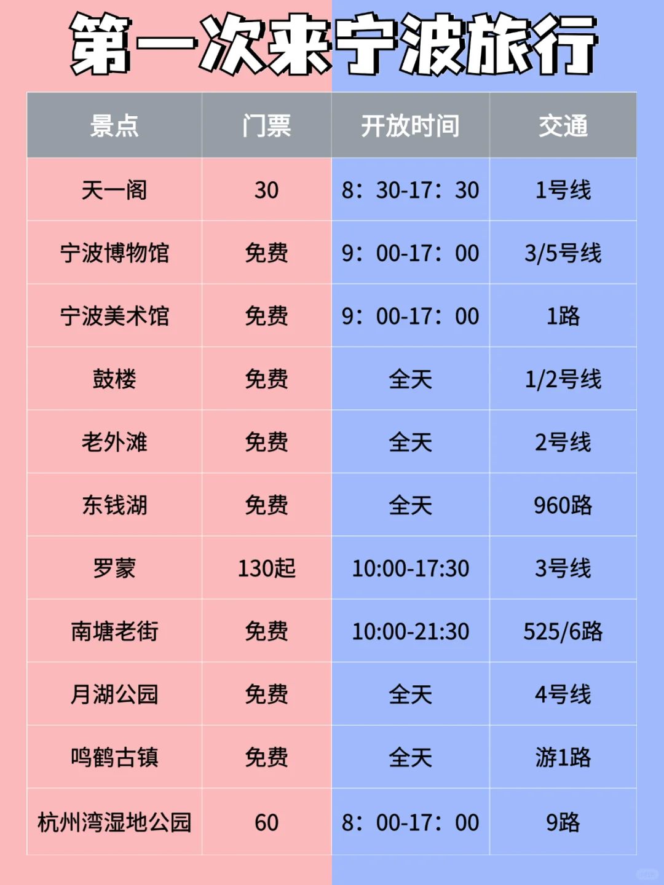

高铁到宁波站最方便！
市区景点集中 地铁/共享单车搞定
东钱湖地铁4号线直达超方便～
# 🗺️【路线安排】
## Day1 老城漫游
📍南塘老街（9:00-11:00）
▪️免费古风街区 油赞子/年糕饺必吃
▪️避雷：别买15元+的网红奶茶！
📍天一阁（11:30-13:30）
🎫学生票15元
▪️现存最古老藏书楼 穿汉服超出片
⚠️周一上午闭馆别跑空
📍鼓楼步行街（14:00-16:00）
▪️中西合璧地标 矮子馅饼必排队
💣避雷：门口水果捞刺客！达咩
📍老外滩（19:00-21:00）
▪️免费夜景天花板 教堂灯光超梦幻
▪️酒吧街浅逛即可 学生党别上头
## Day2 湖光山色
📍东钱湖（9:00-15:00）
🚴租车砍价到20元/小时！
▪️院士中心：网红大树+观景台
▪️利民村：小洱海即视感 湖边茶室发呆
▪️韩岭老街：超有韵味的宋代古街
🍜【美食红黑榜】
✅必吃清单
▫️南塘油赞子：15元/袋 甜咸都好吃
▫️固海糕团：宁波老字号 灰汁团糯叽叽
▫️仓桥面结面：6元/碗 本地人排队店
❌避雷清单
× 景区海鲜大排档（专宰外地人）
× 鼓楼竹筒奶茶（28元拍完照就后悔）
× 梁弄大糕（甜到齁 买两个尝鲜即可）
🏠【住宿Tips】
▪️首选天一广场/鼓楼附近青旅
▪️推荐：背包客青年旅舍（人均50+）
▪️避雷：老外滩民宿（晚上酒吧吵到凌晨）
💡学生党专属彩蛋
1️⃣宁波博物馆免费！《三体》取景地
2️⃣月湖公园划船30元/人 比西湖便宜
3️⃣城隍庙地铁站商业街 10元get女大学生同款美甲
💰花费清单（人均）
交通：60（含单车）
住宿：50
餐饮：120
门票：15
其他：30
——————————
Total：375元（还能更省！）
📸拍照指南：
1️⃣利民村下午4点光线最温柔
2️⃣老外滩教堂晚上开灯更出片
3️⃣韩岭美术馆外观免费拍 高级感拉满
👗穿搭建议：
浅色系连衣裙+草编包=宁波适配度100%

## 旅游路线
宁波火车站➡️南塘老街➡️天一阁博物馆➡️月湖公园➡️美术馆➡️城隍庙➡️天一广场➡️鼓楼➡️老外滩
