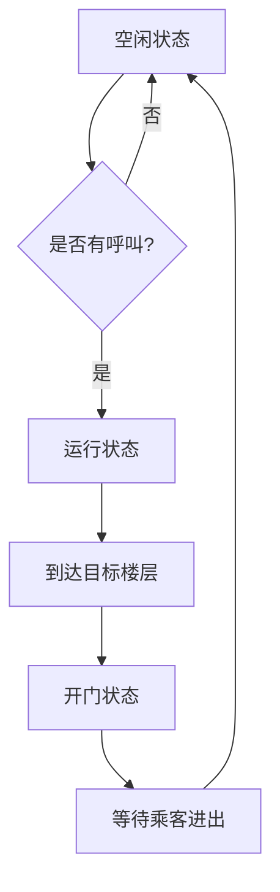

好的！这就补上更全面的知识点，按照「原理大白话+代码示例+对比辨析+避坑指南」展开，涵盖你提到的所有模型，并且尽量用生活化比喻让初学者秒懂：


# 人工智能核心模型与算法超详细解析（从基础到进阶）
## 一、神经网络起源：从感知机到多层网络
### 知识点1：感知机（Perceptron）——神经网络的「始祖」
**一句话原理**：最简单的二分类模型，模仿生物神经元，输入加权求和后过激活函数（阶跃函数）  
**数学公式**：  
$$ z = w_1x_1 + w_2x_2 + ... + w_nx_n + b $$  
$$ \hat{y} = \begin{cases} 
1, & z \geq 0 \\
0, & z < 0 
\end{cases} $$  
**类比**：像「选课决策器」——如果「兴趣分（x1）×0.6 + 学分价值（x2）×0.4 - 逃课风险（b）」≥0，就选课（输出1），否则不选（0）  

**代码实现（纯Python，不用框架）**：  
```python
class Perceptron:
    def __init__(self, lr=0.01, epochs=100):
        self.lr = lr
        self.epochs = epochs
        self.weights = None  # 权重
        self.bias = None     # 偏置
    
    def fit(self, X, y):
        # 初始化参数：权重全0，偏置0
        self.weights = np.zeros(X.shape[1])
        self.bias = 0
        # 梯度下降更新参数
        for _ in range(self.epochs):
            for xi, target in zip(X, y):
                prediction = self.predict(xi)
                # 误差 = 真实值 - 预测值
                error = target - prediction
                # 权重更新：w += lr * error * xi
                self.weights += self.lr * error * xi
                # 偏置更新：b += lr * error
                self.bias += self.lr * error
    
    def predict(self, xi):
        # 加权和 + 阶跃函数
        z = np.dot(xi, self.weights) + self.bias
        return 1 if z >= 0 else 0

# 测试：异或问题（感知机无法解决非线性问题！）
# 注意：感知机只能处理线性可分数据，无法解决异或这种非线性问题，这也是后来引入多层网络的原因
```

**致命缺陷**：只能处理线性可分数据（如直线能分开的两类点），无法解决异或（XOR）问题，催生了多层神经网络。


### 知识点2：BP算法（Backpropagation）——神经网络的「灵魂算法」
**一句话原理**：多层神经网络训练时，从输出层反向计算每个参数的梯度（误差导数），利用链式法则更新权重，解决「如何训练多层网络」的问题  
**类比**：像「考试错题复盘」——知道最后大题做错了（输出误差），倒推是中间某一步公式用错（某层权重需要调整），逐层修正错误  

**核心步骤**（以3层网络为例）：  
1. **前向传播**：输入→隐藏层→输出层，计算预测值 $\hat{y}$  
2. **计算损失**：用MSE或交叉熵计算 $L(\hat{y}, y)$  
3. **反向传播**：  
   - 输出层梯度：$\frac{\partial L}{\partial w^{out}} = \frac{\partial L}{\partial \hat{y}} \cdot \frac{\partial \hat{y}}{\partial w^{out}}$  
   - 隐藏层梯度：$\frac{\partial L}{\partial w^{hid}} = \frac{\partial L}{\partial \hat{y}} \cdot \frac{\partial \hat{y}}{\partial h} \cdot \frac{\partial h}{\partial w^{hid}}$（链式法则）  
4. **参数更新**：$w = w - \eta \cdot \nabla w$（$\eta$ 是学习率）  

**为什么重要**：没有BP算法，多层神经网络无法有效训练，深度学习可能晚诞生20年！现在所有框架（TensorFlow/PyTorch）都内置自动微分，无需手动实现BP，但理解原理能帮你调参。


## 二、经典神经网络模型：从全连接到卷积
### 知识点3：全连接网络（Fully Connected Network, FCN）
**一句话定义**：每层神经元与下一层所有神经元相连（无稀疏连接），又称多层感知机（MLP）  
**结构**：输入层→隐藏层（1层或多层）→输出层，每层用Dense层实现  
**适用场景**：表格数据分类/回归（如iris花分类、房价预测）  
**代码示例（Keras）**：  
```python
model = tf.keras.Sequential([
    layers.Dense(64, activation='relu', input_shape=(10,)),  # 第1隐藏层64神经元
    layers.Dense(32, activation='relu'),                     # 第2隐藏层32神经元
    layers.Dense(1, activation=None)                         # 回归输出
])
```  
**缺点**：参数爆炸（如输入1000维，下一层1000神经元，就有100万参数），不适合图像这种高维数据（催生了CNN）。


### 知识点4：残差神经网络（Residual Network, ResNet）
**解决痛点**：深层网络梯度消失（层数多了反而准确率下降）  
**核心创新**：残差连接（Skip Connection）——让梯度直接跨过若干层，公式：  
$$ h(x) = f(x) + x $$  
**类比**：像「学习捷径」——如果某几层学不到有用信息，直接跳过（走捷径x），避免梯度在层层传递中衰减  

**经典结构（ResNet-50）**：  
```python
# 残差块实现（PyTorch）
class ResidualBlock(nn.Module):
    def __init__(self, in_channels, out_channels, stride=1):
        super().__init__()
        self.conv1 = nn.Conv2d(in_channels, out_channels, kernel_size=3, stride=stride, padding=1)
        self.bn1 = nn.BatchNorm2d(out_channels)
        self.conv2 = nn.Conv2d(out_channels, out_channels, kernel_size=3, padding=1)
        self.bn2 = nn.BatchNorm2d(out_channels)
        # 捷径连接（如果输入输出维度不同，用1x1卷积调整）
        self.shortcut = nn.Sequential()
        if stride != 1 or in_channels != out_channels:
            self.shortcut = nn.Sequential(
                nn.Conv2d(in_channels, out_channels, kernel_size=1, stride=stride),
                nn.BatchNorm2d(out_channels)
            )
    
    def forward(self, x):
        out = F.relu(self.bn1(self.conv1(x)))
        out = self.bn2(self.conv2(out))
        out += self.shortcut(x)  # 残差连接
        return F.relu(out)
```  
**成就**：在ImageNet上首次让152层网络有效训练，准确率超人类，引爆深层网络研究。


## 三、序列建模：处理时间/顺序数据
### 知识点5：循环神经网络（RNN）——记住过去的网络
**核心特性**：隐藏层神经元之间有连接，当前输出依赖历史信息，适合处理序列数据（文本、语音、时间序列）  
**结构示意图**：  
  
（每个时间步t的隐藏状态h_t依赖h_{t-1}和当前输入x_t）  

**代码示例（PyTorch处理文本分类）**：  
```python
class RNN(nn.Module):
    def __init__(self, vocab_size, embedding_dim, hidden_dim, output_dim):
        super().__init__()
        self.embedding = nn.Embedding(vocab_size, embedding_dim)  # 词嵌入层
        self.rnn = nn.RNN(embedding_dim, hidden_dim, batch_first=True)  # RNN层
        self.fc = nn.Linear(hidden_dim, output_dim)
    
    def forward(self, x):
        # x形状：(batch_size, seq_length)
        embedded = self.embedding(x)  # (batch_size, seq_length, embedding_dim)
        output, hidden = self.rnn(embedded)  # output:(batch, seq_len, hidden_dim), hidden:(1, batch, hidden_dim)
        return self.fc(hidden.squeeze(0))  # 取最后时刻的隐藏状态分类
```  
**致命缺陷**：长距离依赖问题（比如句子开头的主语和结尾的动词时态关联，RNN记不住），催生了LSTM/GRU。


### 知识点6：LSTM（长短期记忆网络）——会「选择性遗忘」的RNN
**核心创新**：引入「记忆单元（Cell）」和三个门（遗忘门、输入门、输出门），解决长距离依赖  
**类比**：像「智能笔记本」——  
- 遗忘门：决定删除哪些旧笔记（比如过时的信息）  
- 输入门：决定记录哪些新笔记（重要的信息）  
- 输出门：决定输出哪些笔记内容（当前需要用的信息）  

**结构公式**（不用记公式，看比喻）：  
$$ f_t = \sigma(W_f \cdot [h_{t-1}, x_t] + b_f) $$  
（遗忘门：输出0-1，控制遗忘程度）  

**代码示例（TensorFlow处理时间序列预测）**：  
```python
model = tf.keras.Sequential([
    layers.LSTM(64, return_sequences=True, input_shape=(None, 1)),  # 第一层返回所有时间步隐藏状态
    layers.LSTM(32),  # 第二层返回最后时间步隐藏状态
    layers.Dense(1)
])
```  
**最佳实践**：  
- 处理长序列（如超过500时间步）时，用双向LSTM（Bidirectional LSTM）同时看过去和未来信息  
- `return_sequences=True`用于需要多层LSTM或接CNN的场景，否则默认只返回最后时刻状态


## 四、生成模型：从模仿到创造
### 知识点7：生成对抗网络（GAN）——让两个网络互掐
**核心思想**：两个网络对抗训练  
- **生成器（G）**：目标是生成逼真的假数据（如假图像），让判别器分不清真假  
- **判别器（D）**：目标是正确区分真实数据和生成数据  

**类比**：像「画家与鉴宝师」——  
- 画家（G）不断改进画作，试图骗过鉴宝师（D）  
- 鉴宝师（D）不断提升鉴别能力，最终画家画出以假乱真的作品  

**经典架构（DCGAN，生成手写数字）**：  
```python
# 生成器（转置卷积升维）
def build_generator():
    model = tf.keras.Sequential()
    model.add(layers.Dense(7*7*256, use_bias=False, input_shape=(100,)))
    model.add(layers.BatchNormalization())
    model.add(layers.LeakyReLU())
    model.add(layers.Reshape((7, 7, 256)))
    model.add(layers.Conv2DTranspose(128, (5,5), strides=(1,1), padding='same', use_bias=False))
    model.add(layers.BatchNormalization())
    model.add(layers.LeakyReLU())
    model.add(layers.Conv2DTranspose(1, (5,5), strides=(2,2), padding='same', use_bias=False, activation='tanh'))
    return model

# 判别器（卷积降维）
def build_discriminator():
    model = tf.keras.Sequential()
    model.add(layers.Conv2D(64, (5,5), strides=(2,2), padding='same', input_shape=(28,28,1)))
    model.add(layers.LeakyReLU())
    model.add(layers.Dropout(0.3))
    model.add(layers.Conv2D(128, (5,5), strides=(2,2), padding='same'))
    model.add(layers.LeakyReLU())
    model.add(layers.Dropout(0.3))
    model.add(layers.Flatten())
    model.add(layers.Dense(1, activation='sigmoid'))  # 二分类（真/假）
    return model
```  
**训练技巧**：  
- 生成器输出用`tanh`（范围[-1,1]），真实数据需归一化到同样范围  
- 用 Wasserstein GAN 等改进版解决训练不稳定问题（原版GAN易梯度消失）


### 知识点8：Transformer——用注意力机制「平行思考」
**核心突破**：抛弃循环/卷积，完全基于注意力机制，解决长序列建模效率问题，成为NLP和CV的基石  
**两大核心组件**：  
1. **自注意力（Self-Attention）**：计算序列中每个词与其他所有词的关联度（权重），比如“我昨天去银行”，“银行”要关联“昨天”和“去”  
   $$ \text{Attention}(Q, K, V) = \text{softmax}\left(\frac{QK^T}{\sqrt{d_k}}\right)V $$  
   （Q=查询向量，K=键向量，V=值向量，类比：找钥匙（K）开门（Q），拿到对应物品（V））  

2. **位置编码（Positional Encoding）**：因为Transformer不考虑顺序，需手动加入位置信息（如用正弦函数编码位置）  

**经典应用**：  
- NLP：BERT（双向Transformer编码器，用于文本理解）  
- CV：ViT（Vision Transformer，把图像分块当序列处理）  

**代码片段（PyTorch自注意力层）**：  
```python
class SelfAttention(nn.Module):
    def __init__(self, embed_dim, num_heads):
        super().__init__()
        self.embed_dim = embed_dim
        self.num_heads = num_heads
        self.head_dim = embed_dim // num_heads
        # 线性层映射Q/K/V
        self.q_proj = nn.Linear(embed_dim, embed_dim)
        self.k_proj = nn.Linear(embed_dim, embed_dim)
        self.v_proj = nn.Linear(embed_dim, embed_dim)
        self.out_proj = nn.Linear(embed_dim, embed_dim)
    
    def forward(self, x):
        # x形状：(batch_size, seq_length, embed_dim)
        Q = self.q_proj(x).view(-1, seq_length, self.num_heads, self.head_dim).transpose(1, 2)
        K = self.k_proj(x).view(-1, seq_length, self.num_heads, self.head_dim).transpose(1, 2)
        V = self.v_proj(x).view(-1, seq_length, self.num_heads, self.head_dim).transpose(1, 2)
        # 计算注意力分数
        scores = (Q @ K.transpose(-2, -1)) / (self.head_dim ** 0.5)
        attention = F.softmax(scores, dim=-1) @ V
        attention = attention.transpose(1, 2).contiguous().view(-1, seq_length, self.embed_dim)
        return self.out_proj(attention)
```  


## 五、强化学习：让智能体学会「试错」
### 知识点9：强化学习（Reinforcement Learning, RL）——从游戏中学习
**核心要素**：  
- **智能体（Agent）**：做出决策（如游戏中的玩家）  
- **环境（Environment）**：智能体交互的世界（如游戏场景）  
- **状态（State）**：环境的当前情况（如游戏画面像素）  
- **动作（Action）**：智能体的选择（如上下左右移动）  
- **奖励（Reward）**：动作的反馈（如得分+10，掉血-5）  

**三大范式**：  
1. **基于价值（Value-Based）**：学习状态/动作的价值（如Q-Learning）  
2. **基于策略（Policy-Based）**：直接学习策略函数π(s)→a（如Policy Gradient）  
3. **演员-评论家（Actor-Critic）**：结合两者（如PPO、A3C）  

**Q-Learning示例（迷宫寻宝）**：  
```python
# 简化版Q-Learning代码（表格型，非神经网络）
import numpy as np

class QLearningAgent:
    def __init__(self, state_size, action_size, learning_rate=0.1, gamma=0.95, epsilon=0.1):
        self.Q = np.zeros((state_size, action_size))  # Q表
        self.lr = learning_rate  # 学习率
        self.gamma = gamma      # 折扣因子
        self.epsilon = epsilon  # 探索率（随机动作概率）
    
    def choose_action(self, state):
        if np.random.uniform() < self.epsilon:
            return np.random.choice(action_size)  # 探索：随机选动作
        else:
            return np.argmax(self.Q[state])        # 利用：选Q值最大的动作
    
    def update(self, state, action, reward, next_state):
        old_q = self.Q[state, action]
        next_max_q = np.max(self.Q[next_state])
        new_q = old_q + self.lr * (reward + self.gamma * next_max_q - old_q)
        self.Q[state, action] = new_q

# 环境示例：4状态迷宫，动作0（左）、1（右），终点状态3有奖励+10
# 训练后Q表会学会直接向右走到终点
```  

**对比监督学习**：  
- 监督学习：有明确标签，告诉智能体“正确答案是什么”  
- 强化学习：无标签，只有延迟奖励，智能体通过试错学习（像小孩学走路）


### 知识点10：状态机（State Machine）——强化学习的简化版
**定义**：有限状态自动机（FSM），智能体根据当前状态和输入，转移到下一个状态  
**适用场景**：简单规则场景（如游戏NPC行为、聊天机器人对话流程）  
**示例：电梯控制状态机**：  

**与强化学习区别**：状态机是手动设计规则（专家系统），强化学习是自动从数据中学习策略。


## 六、特殊网络：从记忆到联想
### 知识点11：Hopfield网络——联想记忆的神经网络
**核心功能**：内容寻址存储器，给定部分信息，恢复完整记忆（如看到残缺图片想起完整图像）  
**原理**：基于能量函数的递归网络，每个神经元连接其他所有神经元（无自环），用Hebbian规则训练  
**类比**：像「拼图游戏」——给一片拼图，网络能联想出完整图案  

**数学表达**：  
能量函数：$$ E = -\frac{1}{2}\sum_{i \neq j} w_{ij} s_i s_j - \sum_i b_i s_i $$  
（$s_i$ 是神经元状态±1，$w_{ij}$ 是连接权重，训练时让记忆样本对应能量最小值）  

**应用场景**：早期用于字符识别、纠错码，现在更多用于研究神经科学原理。


## 七、易混淆概念终极对比表
| 概念                | 区别要点                                                                 | 错误示例（新手常犯）                                                     |
|---------------------|--------------------------------------------------------------------------|--------------------------------------------------------------------------|
| 前馈网络 vs 反馈网络 | 前馈：无环，信号单向传播（如CNN/MLP）<br>反馈：有环，含递归连接（如RNN） | 用前馈网络处理时间序列→忽略历史信息，效果差                              |
| 全连接层 vs 卷积层  | 全连接：层间所有神经元相连，参数多<br>卷积层：局部连接+权值共享，参数少  | 用全连接层处理100x100图像→参数10000×10000=1亿，而卷积层用3x3核仅9参数    |
| BP算法 vs 梯度下降  | BP是计算梯度的方法，梯度下降是优化参数的算法                             | 说“用BP算法更新参数”→错误，应是“用BP算梯度，用梯度下降更新参数”          |
| 生成模型 vs 判别模型| 生成：输出新数据（如图像/文本）<br>判别：分类/回归（判断数据类别）        | 用GAN做图像分类→错误，GAN的判别器是二分类（真/假），不能直接分10类别     |


## 八、模型选择指南（新手必备）
### 按数据类型选模型：
| 数据类型         | 推荐模型                          | 原因                                                                 |
|------------------|-----------------------------------|----------------------------------------------------------------------|
| 表格数据         | MLP（全连接网络）、XGBoost        | 表格特征维度低，全连接适合处理线性/非线性关系                         |
| 图像数据         | CNN、Transformer（ViT）            | CNN的卷积核适合提取局部特征，ViT适合处理大尺寸图像（如1024x1024）      |
| 文本数据         | RNN/LSTM、Transformer（BERT）       | RNN处理序列顺序，Transformer的自注意力捕捉长距离依赖（如“他说‘明天爬山’”中的指代）|
| 时间序列         | LSTM、TCN（时间卷积网络）          | LSTM记忆长期依赖，TCN用膨胀卷积并行处理长序列                          |
| 决策/控制问题    | 强化学习（PPO、DQN）               | 需要从延迟奖励中学习策略，如游戏AI、机器人控制                          |

### 按任务类型选模型：
- **分类/回归**：MLP（表格）、CNN（图像）、Transformer（文本）  
- **生成任务**：GAN（图像）、Transformer（文本，如GPT）、VAE（变分自编码器）  
- **序列预测**：LSTM（单步预测）、Transformer（多步预测，如天气预报）  
- **强化学习场景**：Atari游戏用DQN，机器人控制用PPO  


## 九、进阶技巧：从调参到落地
### 1. 模型加速技巧
- **模型量化**：将32位浮点参数转为8位整数，推理速度提升3倍（如TensorRT工具）  
- **剪枝**：删除不重要的连接（如权重接近0的连接），减小模型体积  
- **硬件加速**：  
  - GPU：用CUDA加速矩阵运算（所有框架默认支持）  
  - TPU：Google专用芯片，适合大规模训练（比GPU快10倍）  

### 2. 分布式训练
当数据量超过单卡内存时，用分布式训练：  
```python
# TensorFlow分布式训练（镜像策略）
strategy = tf.distribute.MirroredStrategy()
with strategy.scope():
    model = build_model()  # 模型定义放在作用域内
model.compile(optimizer='adam', loss='mse')
model.fit(dataset, epochs=10, batch_size=64*strategy.num_replicas_in_sync)
```  

### 3. 超参数调优
- **随机搜索**：比网格搜索效率高，适合连续参数（如学习率取1e-3~1e-5之间的随机值）  
- **贝叶斯调优**：用高斯过程建模超参数与性能的关系，自动推荐最优值（用Optuna库）  


## 十、学习资源与避坑清单
### 1. 必看经典资源
- **书籍**：  
  - 《深度学习》（花书）→ 原理深度解析（适合进阶）  
  - 《Hands-On Machine Learning with Scikit-Learn, Keras, and TensorFlow》→ 实战导向（新手推荐）  
- **课程**：  
  - Coursera《Neural Networks and Deep Learning》（吴恩达）→ 神经网络入门  
  - Udacity《Deep Learning Nanodegree》→ 项目驱动学习  

### 2. 新手避坑清单
1. **不要一开始就啃论文**：先掌握框架使用（能跑通MNIST分类、生成假图像），再看论文（否则公式看不懂）  
2. **数据预处理比模型更重要**：花80%时间在数据清洗、增强、标注，模型效果70%取决于数据质量  
3. **可视化很关键**：用TensorBoard看loss曲线、特征可视化，用W&B记录超参数实验（避免重复调参）  
4. **从玩具任务开始**：用MNIST练图像分类、用IMDB练文本情感分析、用CartPole练强化学习，再挑战真实数据  


**总结**：人工智能模型就像「工具箱」，每个模型有适合的场景——CNN是图像专家，Transformer是序列大师，GAN是创造能手，强化学习是决策高手。建议新手按「场景→选模型→调参优化」的思路学习，遇到不懂的先跑通官方示例代码（如TensorFlow Hub的预训练模型），再拆解分析原理。记住：动手写代码的速度，决定你进步的速度！ 💻✨