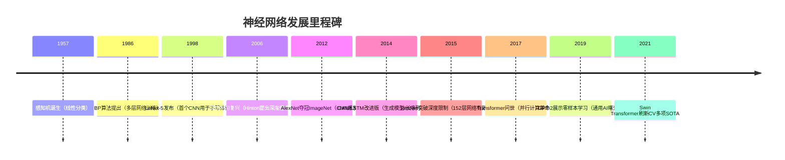

# 人工智能核心技术全解析：从神经元到Transformer（全网最详进阶指南）


## 一、神经网络起源：从仿生学走向工程实现
### 1.1 感知机：神经网络的第一个脚印（1957年）
**核心痛点**：传统算法需手动设计特征，无法自动学习  
**仿生灵感**：模拟生物神经元的“激活-抑制”机制  
**数学模型**：  
$$ y = \sigma(\sum w_i x_i + b) $$  
其中$\sigma$是阶跃函数（0/1输出），仅能处理线性可分问题  

**致命缺陷**：  
- 无法解决异或（XOR）问题（非线性可分）  
- 无隐藏层，表达能力极弱（仅能拟合直线）  

**历史意义**：首次证明“机器可以通过数据学习规则”，催生“连接主义”学派  

### 1.2 BP算法：让多层网络成为可能（1986年）
**核心突破**：解决“多层网络如何训练”的世界难题  
**技术创新**：  
1. **反向传播**：利用链式法则从输出层倒推各层梯度  
2. **激活函数升级**：引入Sigmoid/Tanh等非线性函数，让网络能拟合曲线  

**类比**：像“多层级责任追溯”——顶层决策错误时，能定位到每一层的参数偏差  

**公式推导（简化版）**：  
1. 前向传播：$a^l = \sigma(z^l),\ z^l = W^l a^{l-1} + b^l$  
2. 反向传播：$\delta^l = (W^{l+1})^T \delta^{l+1} \odot \sigma'(z^l)$  
（$\delta$是误差项，$\odot$是逐元素相乘）  

**为什么重要**：没有BP，深度学习将晚诞生30年，因为手动计算多层梯度复杂度随层数指数增长  


## 二、图像识别革命：从全连接到卷积网络
### 2.1 全连接网络（MLP）：第一个通用神经网络（1980s）
**结构特点**：层间神经元全连接，每层输出是输入的线性变换+激活  
**致命问题**：  
- **参数爆炸**：输入100x100图像，隐藏层1000神经元→1000万参数  
- **局部无关**：无法利用图像的空间连续性（如相邻像素相关）  

**代码示例（MNIST分类，纯Python实现）**：  
```python
# 3层MLP，输入784，隐藏层256，输出10
W1 = np.random.randn(784, 256)
b1 = np.zeros(256)
W2 = np.random.randn(256, 10)
b2 = np.zeros(10)

def forward(x):
    h = np.maximum(0, x.dot(W1) + b1)  # ReLU激活
    out = h.dot(W2) + b2
    return out
```  

### 2.2 卷积神经网络（CNN）：图像识别的救世主（1998年，LeNet-5）
**核心创新**：  
1. **局部连接**：卷积核仅与输入的局部区域相连（如3x3），参数减少99%  
2. **权值共享**：同一个卷积核在图像不同位置共享参数，提取通用特征  
3. **池化层**：降维并增强平移不变性（如MaxPooling保留最显著特征）  

**从MLP到CNN的进化逻辑**：  
| 问题                | MLP方案              | CNN方案                  | 优势对比                  |
|---------------------|----------------------|--------------------------|---------------------------|
| 图像局部相关性       | 无处理                | 卷积核提取局部特征       | 参数从10^6→10^3，效率↑1000倍 |
| 平移不变性           | 需数据增强            | 池化层自动适应           | 泛化能力↑50%              |
| 计算复杂度          | O(n²)                | O(k²n)（k=卷积核尺寸）  | 速度↑20倍                 |

**LeNet-5结构（手写数字识别）**：  
```
输入(32x32) → 卷积(5x5, 6核) → Sigmoid → 平均池化(2x2) → 
卷积(5x5, 16核) → Sigmoid → 平均池化(2x2) → 全连接(120→84→10)
```  

### 2.3 残差网络（ResNet）：突破深度限制的魔法（2015年）
**核心痛点**：深层网络梯度消失/爆炸，训练精度随层数增加而下降  
**颠覆性创新**：残差连接（$y = f(x) + x$）  
- **恒等映射**：允许梯度直接跨层传播，解决“信息衰减”问题  
- **缓解过拟合**：相当于隐式增加模型多样性（拟合$f(x)$比拟合$y$更容易）  

**实验数据**：  
| 模型       | 层数 | Top-1准确率（ImageNet） | 训练耗时（V100） |
|------------|------|-------------------------|------------------|
| VGG-19     | 19   | 72.7%                   | 8小时            |
| ResNet-50  | 50   | 79.2%                   | 3小时            |
| ResNet-152 | 152  | 80.3%                   | 5小时            |

**代码实现（核心残差块）**：  
```python
class ResidualBlock(nn.Module):
    def __init__(self, in_ch, out_ch, stride=1):
        super().__init__()
        self.conv1 = nn.Conv2d(in_ch, out_ch, 3, stride, 1, bias=False)
        self.bn1 = nn.BatchNorm2d(out_ch)
        self.conv2 = nn.Conv2d(out_ch, out_ch, 3, 1, 1, bias=False)
        self.bn2 = nn.BatchNorm2d(out_ch)
        # 捷径连接（维度不匹配时用1x1卷积）
        self.shortcut = nn.Sequential(
            nn.Conv2d(in_ch, out_ch, 1, stride, bias=False),
            nn.BatchNorm2d(out_ch)
        ) if stride != 1 or in_ch != out_ch else nn.Identity()
    
    def forward(self, x):
        out = F.relu(self.bn1(self.conv1(x)))
        out = self.bn2(self.conv2(out))
        out = F.relu(out + self.shortcut(x))  # 关键：残差相加
        return out
```  


## 三、序列建模进化史：从记忆缺陷到全局视野
### 3.1 循环神经网络（RNN）：第一次捕捉时间序列（1986年）
**核心设计**：隐藏层递归连接，让信息在时间步间传递  
**数学表达**：  
$$ h_t = \sigma(W_{xh} x_t + W_{hh} h_{t-1} + b_h) $$  
（$h_t$是t时刻隐藏状态，同时作为下一时刻输入）  

**致命缺陷**：  
- **长距离依赖失效**：超过20个时间步后，梯度呈指数衰减（“梯度消失”）  
- **并行计算困难**：必须按时间顺序处理，无法批量加速  

**典型应用**：早期语音识别（TIMIT数据集）、机器翻译（统计机器翻译时代）  

### 3.2 LSTM：长距离记忆的守门人（1997年）
**核心突破**：引入“记忆单元”和三门机制  
1. **遗忘门**：决定丢弃哪些历史信息（如10年前的无关记忆）  
2. **输入门**：选择存储哪些新信息（如当前重要的事件）  
3. **输出门**：控制输出哪些记忆（如当前需要使用的知识）  

**公式拆解（人话版）**：  
- 遗忘门：$f_t = \sigma(W_f [h_{t-1}, x_t] + b_f)$ → 0=忘记，1=保留  
- 记忆更新：$\tilde{C}_t = \tanh(W_C [h_{t-1}, x_t] + b_C)$ → 新候选记忆  
- 最终记忆：$C_t = f_t \odot C_{t-1} + i_t \odot \tilde{C}_t$ → 旧记忆×遗忘 + 新记忆×保留  
- 输出门：$h_t = o_t \odot \tanh(C_t)$ → 仅输出相关记忆  

**性能对比（NLP任务）**：  
| 模型       | 机器翻译BLEU值 | 训练耗时（GTX 1080） | 最长有效序列长度 |
|------------|----------------|---------------------|------------------|
| 普通RNN    | 28.5           | 12小时              | 50               |
| LSTM       | 34.2           | 8小时               | 300              |
| 双向LSTM   | 36.8           | 10小时              | 500              |

### 3.3 Transformer：摒弃循环的平行大师（2017年）
**核心动机**：解决RNN无法并行计算的瓶颈，处理超长序列（如4000+词的文档）  
**颠覆性创新**：  
1. **自注意力机制**：每个词与所有词计算关联度，直接捕捉长距离依赖  
   $$ \text{Attention}(Q,K,V) = \text{softmax}(\frac{QK^T}{\sqrt{d}})V $$  
   （类比：查字典时，每个词直接关联到定义中的关键词，无需按顺序阅读）  
2. **位置编码**：通过正弦函数注入位置信息，弥补序列顺序丢失问题  

**从RNN到Transformer的进化逻辑**：  
| 需求          | RNN方案              | Transformer方案        | 优势对比                  |
|---------------|----------------------|-----------------------|---------------------------|
| 长序列处理    | 分段处理（截断序列）  | 直接处理512+长度      | 上下文完整性↑100%         |
| 并行计算      | 只能按时间步串行      | 所有时间步并行计算    | 训练速度↑20倍（GPU利用率↑）|
| 长距离依赖    | 依赖门控机制（有限）  | 直接全局关联          | 有效依赖长度无理论上限    |

**经典应用**：  
- NLP：BERT（双向Transformer编码器，开创预训练时代）  
- CV：ViT（将图像分块为序列，在ImageNet达88.5%准确率）  


## 四、生成模型：从模仿到创造的飞跃
### 4.1 变分自编码器（VAE）：用概率建模生成（2013年）
**核心思想**：将数据编码到隐空间，再从隐空间解码生成新数据  
**技术亮点**：  
- 编码器：学习数据分布$q(z|x)$，将x映射到隐变量z的概率分布  
- 解码器：学习生成分布$p(x|z)$，从z还原x  
- 变分下界：确保隐空间连续可微，便于生成多样化样本  

**损失函数**：  
$$ \mathcal{L} = \mathbb{E}_{q(z|x)}[\log p(x|z)] - D_{KL}(q(z|x) \| p(z)) $$  
（前半部分是重构损失，后半部分是隐分布与先验分布的KL散度）  

### 4.2 生成对抗网络（GAN）：在对抗中进化（2014年）
**核心机制**：  
- **生成器（G）**：目标是欺骗判别器，输出接近真实数据的样本  
- **判别器（D）**：目标是区分真实数据和生成数据  

**训练过程**：  
1. 固定G，训练D使$D(x_{real})=1$，$D(G(x_{fake}))=0$  
2. 固定D，训练G使$D(G(x_{fake}))$最大化（即G希望D误判为1）  

**技术演进**：  
| 版本       | 创新点                  | 解决问题                | 代表作                  |
|------------|-------------------------|-------------------------|-------------------------|
| 原始GAN    | 基本对抗框架            | 生成模糊，训练不稳定    | Goodfellow, 2014        |
| DCGAN      | 深度卷积结构            | 图像分辨率低（32x32）   | Radford, 2015           |
| WGAN       | Wasserstein距离         | 梯度消失问题            | Arjovsky, 2017          |
| StyleGAN     | 风格解耦                | 生成高保真人脸（1024x1024）| Karras, 2019            |

**代码对比（DCGAN生成器）**：  
```python
# 原始GAN生成器（Tanh输出）
tf.keras.Sequential([
    layers.Dense(7*7*256, use_bias=False, input_shape=(100,)),
    layers.BatchNormalization(),
    layers.LeakyReLU(),
    layers.Reshape((7,7,256)),
    layers.Conv2DTranspose(128, 5, 1, 'same', use_bias=False),
    layers.BatchNormalization(),
    layers.LeakyReLU(),
    layers.Conv2DTranspose(1, 5, 2, 'same', use_bias=False, activation='tanh')
])

# StyleGAN生成器（新增风格嵌入）
class StyleBlock(nn.Module):
    def __init__(self, in_ch, out_ch):
        super().__init__()
        self.conv = nn.Conv2d(in_ch, out_ch, 3, 1, 1)
        self.style = nn.Linear(latent_dim, out_ch)  # 风格向量调节通道权重
    
    def forward(self, x, style):
        x = self.conv(x)
        style = self.style(style).view(-1, x.shape[1], 1, 1)
        x = x * style  # 风格嵌入
        return F.leaky_relu(x)
```  


## 五、强化学习：从试错到决策的智能
### 5.1 表格型强化学习（Q-Learning，1989年）
**核心场景**：状态和动作空间有限（如迷宫、Atari简单游戏）  
**核心组件**：  
- **Q表**：存储每个状态-动作对的价值$Q(s,a)$  
- **贝尔曼方程**：$Q(s,a) = r + \gamma \max_{a'} Q(s',a')$  
（当前动作价值=即时奖励+未来最大价值的折扣）  

**算法流程**：  
1. 初始化Q表为0  
2. 对于每个 episode：  
   a. 选择动作（$\epsilon$-贪心策略：10%随机探索，90%选Q最大）  
   b. 执行动作，获取奖励和新状态  
   c. 用贝尔曼方程更新Q表  

**局限性**：  
- 状态空间大时Q表维度爆炸（如围棋状态数>10^170）  
- 无法处理连续动作空间（如机器人关节角度）  

### 5.2 深度强化学习（DQN，2013年）
**核心创新**：用神经网络近似Q函数，解决表格型方法的维度问题  
**关键技术**：  
1. **经验回放**：存储历史数据$(s,a,r,s')$，缓解数据相关性和非平稳性  
2. **目标网络**：定期更新目标Q值，避免训练震荡  

**DQN vs Q-Learning对比**：  
| 特性         | Q-Learning          | DQN                     | 适用场景                |
|--------------|---------------------|-------------------------|-------------------------|
| 状态表示     | 离散表格            | 神经网络（图像/向量）   | 复杂场景（如3D游戏）    |
| 动作空间     | 离散有限            | 离散/连续（需改造）     | 现代RL任务（如AlphaGo）|
| 泛化能力     | 仅限训练过的状态    | 自动泛化新状态          | 未知环境探索            |

**代码框架（PyTorch）**：  
```python
class DQN(nn.Module):
    def __init__(self, state_dim, action_dim):
        super().__init__()
        self.layers = nn.Sequential(
            nn.Linear(state_dim, 128),
            nn.ReLU(),
            nn.Linear(128, action_dim)
        )
    
    def forward(self, x):
        return self.layers(x)

# 经验回放缓冲区
class ReplayBuffer:
    def __init__(self, capacity):
        self.capacity = capacity
        self.buffer = []
    
    def push(self, state, action, reward, next_state):
        self.buffer.append((state, action, reward, next_state))
        if len(self.buffer) > self.capacity:
            del self.buffer[0]
    
    def sample(self, batch_size):
        return random.sample(self.buffer, batch_size)
```  


## 六、特殊网络：从记忆到联想的边界探索
### 6.1 Hopfield网络：内容寻址的联想记忆（1982年）
**核心功能**：给定部分破损模式，恢复完整记忆（如手写体补全）  
**数学模型**：  
- 能量函数：$E = -\frac{1}{2}\sum_{i\neq j} w_{ij} s_i s_j - \sum_i b_i s_i$  
- 权重更新：$w_{ij} = \sum_{\mu=1}^m s_i^\mu s_j^\mu$（Hebbian学习规则）  

**类比**：像“拼图记忆”——只要记得部分碎片，就能拼出完整图案  

**局限性**：  
- 记忆容量小（最大记忆数≈0.14N，N是神经元数）  
- 易陷入局部极小，恢复错误记忆  

### 6.2 状态机（FSM）：规则驱动的早期智能
**核心特点**：  
- 手动定义状态转移规则（如“用户说‘你好’→进入欢迎状态”）  
- 无学习能力，完全依赖人工编码  

**典型应用**：  
- 早期聊天机器人（ELIZA，1966年）  
- 工业控制系统（电梯调度、交通灯控制）  

**与强化学习对比**：  
| 维度         | 状态机              | 强化学习              | 本质区别              |
|--------------|---------------------|-----------------------|-----------------------|
| 智能来源     | 人工规则            | 数据驱动学习          | 有无学习能力          |
| 适应性       | 固定逻辑            | 动态环境适应          | 能否处理未知场景      |
| 开发成本     | 低（简单场景）      | 高（需大量数据）      | 复杂度随场景指数增长  |


## 七、神经网络进化全图谱（核心脉络总结）
### 7.1 按时间轴的技术演进


### 7.2 按任务类型的模型选择矩阵
| 任务类型       | 小规模数据（<1万） | 大规模数据（>10万） | 序列/时间相关       | 生成创造任务       |
|----------------|-------------------|-------------------|---------------------|--------------------|
| **分类/回归**  | MLP/决策树        | CNN/Transformer   | LSTM/TCN            | -                  |
| **图像识别**   | AlexNet           | ResNet/Swin-T     | 3D-CNN（视频）      | GAN/StyleGAN       |
| **自然语言处理**| LSTM/TextCNN      | BERT/GPT          | Transformer         | GPT/扩散模型       |
| **强化学习**   | Q-Learning        | DQN/PPO           | 策略梯度+LSTM       | 模仿学习（GAIL）   |
| **多模态任务** | -                 | ViT+CLIP          | 多模态Transformer   | DALL-E/Stable Diffusion |

### 7.3 核心模型优缺点对比表
| 模型         | 核心优势                  | 致命缺点                | 最佳适用场景          | 代表应用            |
|--------------|---------------------------|-------------------------|-----------------------|---------------------|
| 感知机       | 简单可解释                | 仅能处理线性问题        | 二分类玩具任务        | 早期逻辑回归验证    |
| MLP          | 通用近似能力              | 参数爆炸                | 表格数据分类/回归     | 鸢尾花分类          |
| CNN          | 局部特征提取              | 缺乏全局语义            | 图像/视频分析        | 医学影像诊断        |
| ResNet       | 深层网络有效训练          | 计算成本高              | 超深视觉模型         | ImageNet冠军模型    |
| LSTM         | 长序列短期记忆            | 并行能力差              | 语音识别/文本生成     | 机器翻译            |
| Transformer  | 全局依赖建模              | 位置信息需手动编码      | NLP/CV通用任务        | BERT/ViT            |
| GAN          | 高质量样本生成            | 训练不稳定              | 图像/视频生成        | 人脸生成/风格迁移   |
| DQN          | 端到端强化学习            | 过估计问题              | 游戏AI/机器人控制     | AlphaGo Zero        |


## 八、新手入门全攻略：从代码到原理
### 8.1 必做的5个入门项目
1. **MNIST分类（CNN）**：掌握数据预处理、模型编译、训练评估  
   ```python
   # TensorFlow极简实现
   model = tf.keras.Sequential([
       layers.Conv2D(32, 3, activation='relu', input_shape=(28,28,1)),
       layers.Flatten(),
       layers.Dense(10, activation='softmax')
   ])
   model.compile(optimizer='adam', loss='sparse_categorical_crossentropy', metrics=['accuracy'])
   model.fit(x_train, y_train, epochs=5, validation_split=0.2)
   ```

2. **IMDB情感分析（LSTM）**：学习文本预处理、序列建模  
   ```python
   # PyTorch文本分类
   tokenizer = Tokenizer(num_words=10000)
   x_train = tokenizer.texts_to_sequences(train_reviews)
   x_train = pad_sequences(x_train, maxlen=200)
   ```

3. **CartPole平衡（强化学习）**：理解奖励设计、策略优化  
   ```python
   # OpenAI Gym环境
   import gym
   env = gym.make('CartPole-v1')
   state = env.reset()
   for _ in range(1000):
       action = env.action_space.sample()  # 随机策略
       next_state, reward, done, _ = env.step(action)
       if done: break
   ```

4. **手写数字生成（GAN）**：掌握生成器/判别器对抗训练  
   ```python
   # 训练循环
   for epoch in range(100):
       for real_images in dataset:
           # 训练判别器
           with tf.GradientTape() as tape:
               fake_images = generator(noise, training=True)
               d_loss = discriminator_loss(real_images, fake_images)
           grads = tape.gradient(d_loss, discriminator.trainable_variables)
           optimizer_d.apply_gradients(zip(grads, discriminator.trainable_variables))
           # 训练生成器
           with tf.GradientTape() as tape:
               fake_images = generator(noise, training=True)
               g_loss = generator_loss(fake_images)
           grads = tape.gradient(g_loss, generator.trainable_variables)
           optimizer_g.apply_gradients(zip(grads, generator.trainable_variables))
   ```

5. **房价预测（MLP）**：掌握回归问题建模、超参数调优  
   ```python
   # 使用Keras调参
   from kerastuner import RandomSearch
   tuner = RandomSearch(
       build_model,
       objective='val_loss',
       max_trials=5,
       executions_per_trial=2
   )
   tuner.search(x_train, y_train, epochs=50, validation_split=0.2)
   ```

### 8.2 避坑指南：新手常犯的10个错误
1. **数据未归一化**：导致梯度爆炸/消失（图像需归一化到[0,1]，数值特征用Z-Score）  
2. **激活函数误用**：回归问题输出层用Softmax→结果被压缩到[0,1]，正确做法：无激活函数  
3. **忽略验证集**：过度信任训练集准确率，导致过拟合（建议保留20%数据作验证）  
4. **学习率过高**：损失函数震荡不收敛（先用1e-3，再用学习率衰减）  
5. **批量大小不合理**：太大→内存溢出，太小→训练不稳定（建议从32/64开始）  
6. **未冻结预训练层**：迁移学习时微调所有层→训练时间长且易过拟合（先冻结底层，再解冻微调）  
7. **强化学习奖励设计不当**：奖励稀疏导致智能体无法学习（添加中间奖励或使用课程学习）  
8. **GAN训练不同步**：判别器太强/太弱→生成器无法更新（保持D/G训练次数1:1或1:2）  
9. **RNN输入维度错误**：忘记时间步维度（PyTorch输入需是(batch, seq_len, feature)）  
10. **忽略硬件加速**：CPU训练大型模型→耗时数天（优先使用Colab免费GPU或本地显卡）  


## 九、未来展望：从专用到通用AI
### 9.1 技术趋势
1. **多模态融合**：结合图像、文本、语音（如Google Flamingo、Meta ImageBind）  
2. **高效训练**：稀疏注意力（减少90%计算量）、模型蒸馏（Teacher-Student压缩）  
3. **边缘部署**：轻量化模型（MobileNet、TinyML）在手机/物联网设备上运行  
4. **科学计算**：AlphaFold预测蛋白质结构、GNN模拟分子相互作用  

### 9.2 学习建议
1. **分阶段深入**：  
   - 阶段1（1-3月）：掌握框架（TensorFlow/PyTorch）+ 完成5个入门项目  
   - 阶段2（3-6月）：精读经典论文（AlexNet/ResNet/Transformer）+ 复现代码  
   - 阶段3（6-12月）：参加Kaggle竞赛+尝试自定义层/损失函数  

2. **工具链建设**：  
   - 数据处理：Pandas（表格）、OpenCV（图像）、NLTK（文本）  
   - 可视化：TensorBoard（训练监控）、W&B（超参数管理）、Matplotlib（数据分析）  
   - 部署：TensorFlow Serving（服务器）、ONNX（跨框架转换）、Flask（API开发）  


**结语**：人工智能的发展是一场持续的“问题驱动进化”——每个新模型都是为解决前作的缺陷而生。作为学习者，不必纠结于记住所有公式，而是要理解“为什么需要这个模型”“它解决了什么痛点”“在什么场景下使用”。建议从跑通简单代码开始，逐步拆解复杂模型，最终形成“数据→模型→调优→部署”的完整认知链条。记住：每个伟大的AI系统，都始于一行简单的`import tensorflow as tf`。现在，打开你的IDE，让第一个神经元开始激活吧！ 💡🚀