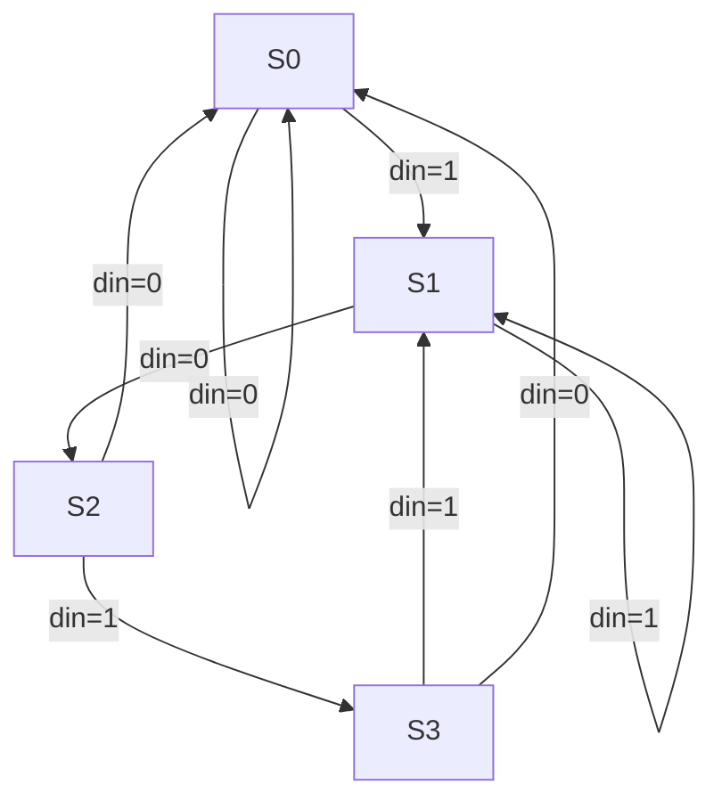
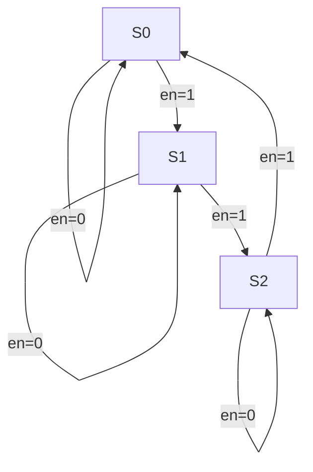
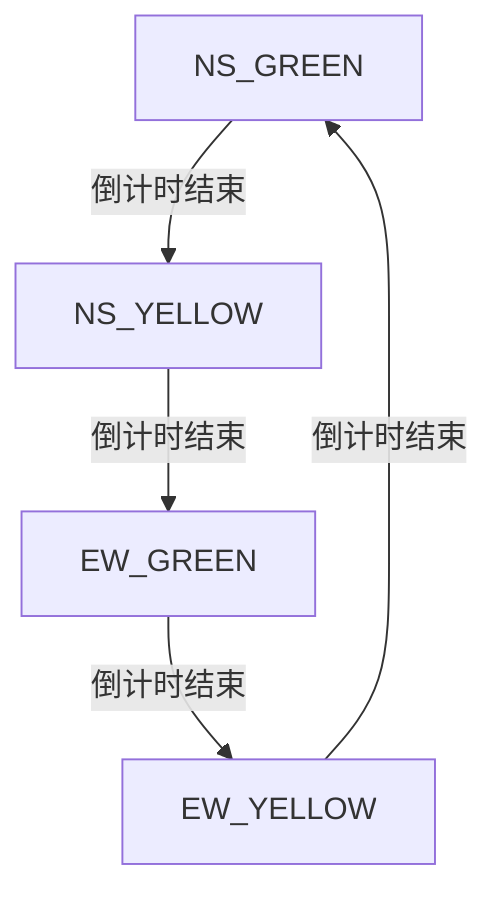

# 有限状态机（FSM）设计实例

有限状态机（Finite State Machine, FSM）是数字系统设计中处理时序逻辑的重要模型，广泛应用于序列检测、控制逻辑、协议处理等场景。以下通过三个典型案例，详细展示 Moore 型和 Mealy 型状态机的设计方法。

## 一、Moore 型状态机：序列检测（检测 "101" 序列）

### 功能描述

输入一个串行比特流，当检测到连续输入 "101" 时，输出 detect 信号为高电平（持续 1 个周期）。输出仅依赖于当前状态（Moore 型）。

### 状态定义（二进制编码）

状态| 编码| 含义
---|---|---
S0| 2'b00| 初始状态（无有效输入）
S1| 2'b01| 检测到第一个 '1'
S2| 2'b10| 检测到 '10' 序列
S3| 2'b11| 检测到 '101' 序列（终止状态）

### 状态转移图



### Verilog 代码实现

#### 状态的存储和状态转换的逻辑进行分离，实现代码块之间的解耦
###### 存储很简单，而状态的转换其实就是多个组合逻辑电路（多个子神经元）
```verilog
module sequence_detector (
    input clk,       // 时钟
    input rst_n,     // 复位（低有效）
    input din,       // 输入比特流
    output reg detect // 检测信号（高有效）
);

// 状态定义
parameter S0 = 2'b00, S1 = 2'b01, S2 = 2'b10, S3 = 2'b11;

reg [1:0] current_state, next_state;

// 状态寄存器（时序逻辑）
always @(posedge clk or negedge rst_n) begin
    if (!rst_n)
        current_state <= S0;
    else
        current_state <= next_state;
end

// 状态转移逻辑（组合逻辑）
always @(*) begin
    case (current_state)
        S0: begin
            if (din == 1'b1)
                next_state = S1;
            else
                next_state = S0;
        end
        S1: begin
            if (din == 1'b0)
                next_state = S2;
            else if (din == 1'b1) // 连续'1'，保持S1
                next_state = S1;
            else
                next_state = S0; // 非法输入，默认回到S0
        end
        S2: begin
            if (din == 1'b1)
                next_state = S3;
            else if (din == 1'b0) // '10'后接'0'，回到S0（无法形成有效序列）
                next_state = S0;
            else
                next_state = S0;
        end
        S3: begin
            if (din == 1'b1) // '101'后接'1'，进入S1（新序列开始）
                next_state = S1;
            else if (din == 1'b0) // '101'后接'0'，回到S0
                next_state = S0;
            else
                next_state = S0;
        end
        default: next_state = S0;
    endcase
end

// 输出逻辑（仅依赖当前状态，Moore型）
always @(*) begin
    detect = (current_state == S3) ? 1'b1 : 1'b0;
end

endmodule
```

## 二、Mealy 型状态机：带使能的模 3 计数器

### 功能描述

当使能信号 en 为高电平时，计数器在时钟上升沿递增，计数到 2 后回到 0；en 为低电平时保持当前值。输出 cout 在计数值为 2 且 en 为高时产生进位信号（提前一个周期响应输入，Mealy 型）。

### 状态定义（独热码编码，适合 FPGA）

Verilog

```
parameter S0 = 3'b001, S1 = 3'b010, S2 = 3'b100; // 3个状态，独热码
```

### 状态转移与输出逻辑

当前状态| 输入 en| 下一状态| 输出 cout
---|---|---|---
S0| 0| S0| 0
S0| 1| S1| 0
S1| 0| S1| 0
S1| 1| S2| 0
S2| 0| S2| 0
S2| 1| S0| 1

### 状态转移图



### Verilog 代码实现

```verilog
module mod3_counter (
    input clk,    // 时钟
    input rst_n,  // 复位（低有效）
    input en,     // 使能信号（高有效）
    output reg [1:0] q,  // 计数值（0-2）
    output reg cout       // 进位信号（高有效）
);

// 状态定义（独热码）
parameter S0 = 3'b001, S1 = 3'b010, S2 = 3'b100;

reg [2:0] current_state, next_state;

// 状态寄存器
always @(posedge clk or negedge rst_n) begin
    if (!rst_n)
        current_state <= S0;
    else
        current_state <= next_state;
end

// 状态转移与输出逻辑（Mealy型，输出依赖输入en）
always @(*) begin
    case (current_state)
        S0: begin
            q = 2'b00;
            if (en) begin
                next_state = S1;
                cout = 1'b0; // 转移到S1，输出0
            end else begin
                next_state = S0;
                cout = 1'b0;
            end
        end
        S1: begin
            q = 2'b01;
            if (en) begin
                next_state = S2;
                cout = 1'b0; // 转移到S2，输出0
            end else begin
                next_state = S1;
                cout = 1'b0;
            end
        end
        S2: begin
            q = 2'b10;
            if (en) begin
                next_state = S0;
                cout = 1'b1; // 转移到S0，输出1（进位）
            end else begin
                next_state = S2;
                cout = 1'b0;
            end
        end
        default: begin
            q = 2'b00;
            next_state = S0;
            cout = 1'b0;
        end
    endcase
end

endmodule
```

## 三、复杂状态机：交通灯控制（含倒计时显示）

### 功能描述

实现十字路口交通灯控制，包含南北（NS）和东西（EW）两个方向，状态切换伴随倒计时显示（4 位 LED 显示剩余时间）：

状态 1：NS 绿灯（40s），EW 红灯

状态 2：NS 黄灯（5s），EW 红灯

状态 3：EW 绿灯（40s），NS 红灯

状态 4：EW 黄灯（5s），NS 红灯

### 状态定义（二进制编码，含时间参数）

Verilog

```
parameter
    NS_GREEN = 2'b00,  // 状态0：NS绿灯，EW红灯
    NS_YELLOW = 2'b01, // 状态1：NS黄灯，EW红灯
    EW_GREEN = 2'b10,  // 状态2：EW绿灯，NS红灯
    EW_YELLOW = 2'b11; // 状态3：EW黄灯，NS红灯

parameter
    GREEN_TIME = 40,    // 绿灯持续时间（秒）
    YELLOW_TIME = 5;    // 黄灯持续时间（秒）
```

### 状态转移逻辑

```
NS_GREEN (40s) --倒计时结束-> NS_YELLOW (5s) --倒计时结束-> EW_GREEN (40s) --倒计时结束-> EW_YELLOW (5s) --倒计时结束-> NS_GREEN
```

### 状态转移图



### Verilog 代码实现（核心逻辑）

#### 关键在于状态的跳转:从黄灯和绿灯之间的变换逻辑跳转到定时器计数的逻辑 

##### 人需要对当前的情况、状态进行判断，但是计算机不需要！因为在它看来下一个状态是确定的，本就如此
```verilog
module traffic_light (
    input clk,       // 1Hz时钟（1秒计数）
    input rst_n,     // 复位（低有效）
    output [1:0] ns_light,  // NS方向灯（00=红，01=黄，10=绿）
    output [1:0] ew_light,  // EW方向灯
    output reg [5:0] count   // 倒计时显示（0-49）
);

// 状态定义
parameter
    NS_GREEN = 2'b10, NS_YELLOW = 2'b01,
    EW_GREEN = 2'b10, EW_YELLOW = 2'b01; // 灯状态编码（绿=10，黄=01，红=00）
    //因为这里不可能两边都红灯或绿灯啥的(互斥锁与信号量),所以直接分配同一个状态就行

reg [1:0] current_state, next_state;

// 状态寄存器
always @(posedge clk or negedge rst_n) begin
    if (!rst_n) begin
        current_state <= NS_GREEN;
        count <= GREEN_TIME;
    end else begin
        if (count == 0) begin // 倒计时结束，切换状态
            case (current_state)
                NS_GREEN: next_state = NS_YELLOW;
                NS_YELLOW: next_state = EW_GREEN;
                EW_GREEN: next_state = EW_YELLOW;
                EW_YELLOW: next_state = NS_GREEN;
                default: next_state = NS_GREEN;
            endcase
            count <= (current_state == NS_GREEN || current_state == EW_GREEN) ? GREEN_TIME : YELLOW_TIME;
            //这里还可以更加复杂,比如南北和东西交通灯闪烁的时间不同
        end else begin
            count <= count - 1; // 倒计时递减
            next_state <= current_state; // 未到切换时间，保持当前状态
        end
    end
end

// 输出逻辑（根据状态设置灯信号）
assign ns_light = (current_state == NS_GREEN) ? 2'b10 :
                  (current_state == NS_YELLOW) ? 2'b01 : 2'b00; // 否则红灯
assign ew_light = (current_state == EW_GREEN) ? 2'b10 :
                  (current_state == EW_YELLOW) ? 2'b01 : 2'b00;
//类比这个可以写三个数比较大小的逻辑:
//a>b?a:(b>c)?b:c;
//a<b?a:(b<c)?b:c;

endmodule
```

## 四、状态机设计总结

| 类型      | 输出依赖      | 优点                  | 典型应用场景    |
| ------- | --------- | ------------------- | --------- |
| Moore 型 | 当前状态      | 抗干扰能力强（输出同步）        | 序列检测、计数器  |
| Mealy 型 | 当前状态 + 输入 | 响应速度快（提前一个周期）       | 控制逻辑、协议处理 |
| 独热码编码   | 状态数≤触发器资源 | FPGA 中资源效率高（减少组合逻辑） | 中低速状态机    |
| 二进制编码   | 状态数较多     | 节省寄存器资源             | ASIC 设计   |

### 最佳实践

  * 明确状态机类型：根据输出是否依赖输入选择 Moore/Mealy 型。
  * 状态编码选择：FPGA 优先独热码，ASIC 优先二进制码或格雷码（减少毛刺）。
  * 避免非法状态：添加 default 分支，复位时初始化到有效状态。
  * 时序与组合逻辑分离：状态寄存器用时序逻辑，转移和输出用组合逻辑（或寄存器输出优化时序）。

通过以上实例，可掌握从简单序列检测到复杂控制逻辑的状态机设计方法，实际应用中需结合具体场景选择合适的编码方式和实现策略。