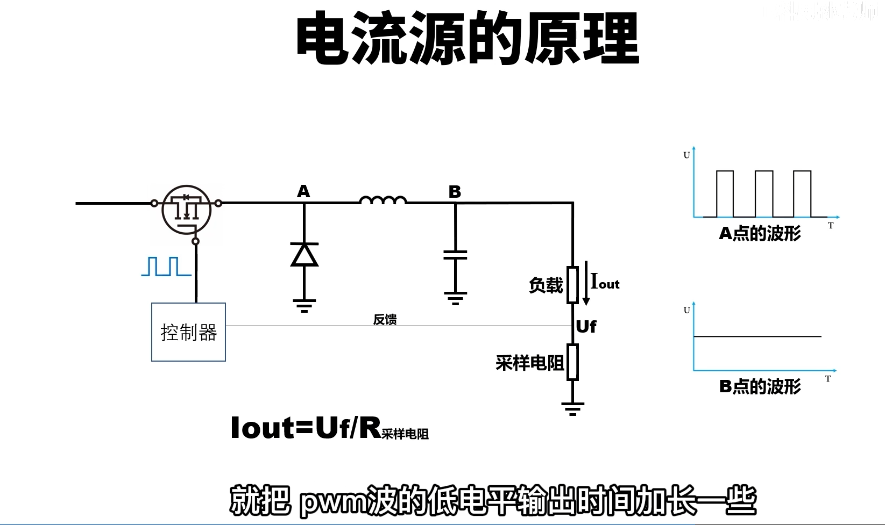
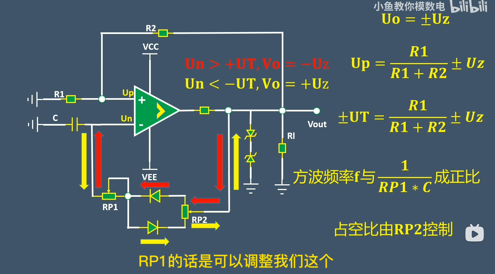
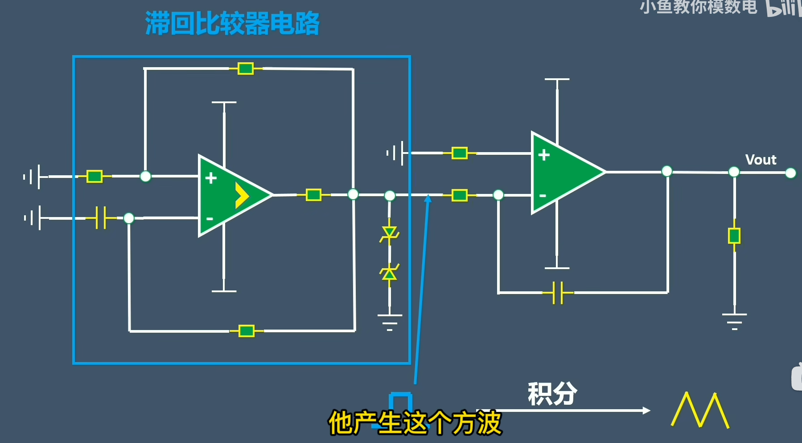
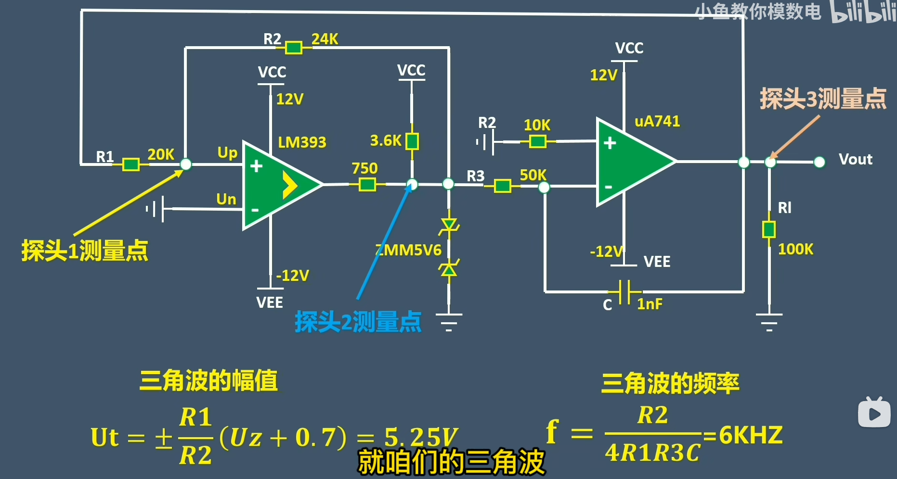

## 电流源电路
**最简单的恒流源电路:**
![[Pasted image 20250525164116.png]]

![[Pasted image 20250509094937.png]]

- **镜像电流源工作的实质是进行了电路的解耦**
![[Pasted image 20250525111838.png]]
### 多路电流源电路:
- **多路比例电流源电路:**
![[Pasted image 20250525134516.png]]
![[Pasted image 20250525134457.png]]
## 差分放大电路:
![[Pasted image 20250509095553.png]]
[[反馈的判断]]
[[卷积 计算]]
## 自激振荡电路:
- 选通网络的模型也可以等效为分压模型,只不过和之前的纯电阻相比多了个相位,但是取个实部Re()的话其实就是对赋值进行了一个变换
![[Pasted image 20250525214725.png]]
![[Pasted image 20250509170320.png]]

## 滞回比较器:
![[Pasted image 20250509171044.png]]

## 方波和三角波发生电路:
### 通过改变反馈线上的电阻还可以改变输出的波形
![[Pasted image 20250509171438.png]]

## 倍压整流电路:
### 利用了电容电压不会突变![[Pasted image 20250509180514.png]]

### 这个电路左边是正弦信号发生器(本质是某个特定频率阻抗最小),同时还带有升压功能:
![[Pasted image 20250509180622.png]]
![[Pasted image 20250509180800.png]]

## 精度更高的信号发生器---IGBT,利用编程来实现开关,然后通过pwm等效出正弦波![[Pasted image 20250509183423.png]]

## 全波和半波整流电路:
### 注意有效值,最大值和平均值的区别
![[Pasted image 20250510160900.png]]
## ...

[[反馈的判断]]
[[概念的判断]]