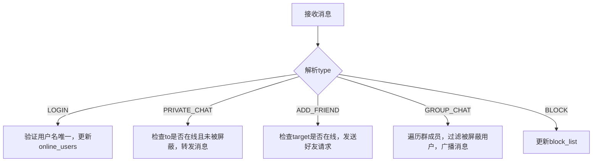

### C++ 进阶网络聊天室（支持好友、私聊、群聊、屏蔽）全解析


以下实现一个**支持用户认证、好友管理、私聊/群聊、消息屏蔽**的进阶聊天室。核心涉及**自定义协议设计、多线程状态管理、TCP粘包处理**等技术点，代码基于C++17和POSIX线程。


---

## 一、核心功能与协议设计


### 1.1 功能列表
| 功能             | 描述                                                                 |
|------------------|----------------------------------------------------------------------|
| 用户认证         | 客户端登录时提供用户名（唯一标识）                                   |
| 加好友           | 用户A发送好友请求，用户B同意后双方成为好友                           |
| 私聊             | 用户向好友或在线用户发送私密消息                                     |
| 群聊             | 创建群组并邀请成员，消息广播至群内所有成员                           |
| 屏蔽用户         | 屏蔽特定用户的消息（私聊和群聊均被屏蔽）                             |
| 在线状态同步     | 服务器维护在线用户列表，支持查询好友/群成员状态                       |


### 1.2 消息协议设计（JSON格式）
为解决TCP流的“粘包”问题，消息采用**长度前缀+JSON内容**的格式：  
- **长度前缀**：4字节（网络字节序），表示后续JSON内容的字节数。  
- **JSON内容**：包含操作类型（`type`）和具体参数（`data`）。  


**示例消息**：  
```json
// 登录请求
{
  "type": "LOGIN",
  "data": { "username": "alice" }
}

// 私聊消息
{
  "type": "PRIVATE_CHAT",
  "data": {
    "from": "alice",
    "to": "bob",
    "message": "晚上一起吃饭？"
  }
}

// 加好友请求
{
  "type": "ADD_FRIEND",
  "data": { "requester": "alice", "target": "bob" }
}
```


---

## 二、核心API与知识点


### 2.1 关键API（C++/POSIX）
| API/工具          | 功能                                                                 | 知识点                                                                 |
|--------------------|----------------------------------------------------------------------|-------------------------------------------------------------------------|
| `socket()`         | 创建套接字                                                           | TCP/IP协议族、套接字类型（`SOCK_STREAM`）                                |
| `bind()`/`listen()`/`accept()` | 服务器绑定、监听、接受连接                                         | 地址绑定、监听队列、三次握手                                            |
| `connect()`        | 客户端连接服务器                                                     | 客户端地址分配、四次挥手                                                |
| `send()`/`recv()`  | 发送/接收数据                                                        | TCP流特性、粘包问题（需手动处理长度前缀）                                |
| `pthread_create()` | 创建线程处理客户端请求                                               | 多线程并发、线程安全（共享数据需加锁）                                    |
| `std::mutex`       | 互斥锁（C++11）                                                      | 线程同步、竞态条件（如修改在线用户列表时）                                |
| `nlohmann/json`    | JSON解析库（需自行安装）                                             | 自定义协议设计、消息序列化/反序列化                                      |


### 2.2 核心知识点
#### 2.2.1 粘包处理
TCP是面向流的协议，`recv()`可能一次读取多个消息，或一个消息被分多次读取。解决方案：  
- **长度前缀法**：每条消息前添加4字节的长度字段（网络字节序），接收时先读长度，再读指定长度的内容。  


#### 2.2.2 多线程状态管理
服务器需维护以下共享数据（需用互斥锁保护）：  
- `online_users`：`std::map<std::string, int>`（用户名→套接字描述符）  
- `friend_list`：`std::map<std::string, std::set<std::string>>`（用户→好友集合）  
- `group_list`：`std::map<std::string, std::set<std::string>>`（群名→成员集合）  
- `block_list`：`std::map<std::string, std::set<std::string>>`（用户→被屏蔽用户集合）  


#### 2.2.3 消息路由逻辑
服务器收到消息后，根据`type`字段路由到不同处理函数：  



---

## 三、服务器端实现（C++）


### 3.1 代码结构
```cpp
// 依赖：nlohmann/json（需安装）、pthread
#include <iostream>
#include <string>
#include <map>
#include <set>
#include <mutex>
#include <thread>
#include <sys/socket.h>
#include <netinet/in.h>
#include <arpa/inet.h>
#include <unistd.h>
#include <cstring>
#include "json.hpp"

using json = nlohmann::json;

// 共享数据结构（需加锁）
std::map<std::string, int> online_users;        // 在线用户（用户名→套接字）
std::map<std::string, std::set<std::string>> friend_list; // 好友列表
std::map<std::string, std::set<std::string>> group_list;  // 群聊列表
std::map<std::string, std::set<std::string>> block_list;   // 屏蔽列表
std::mutex data_mutex;                          // 保护共享数据的互斥锁


### 3.2 工具函数：发送带长度前缀的消息
```cpp
// 发送消息（长度前缀+JSON内容）
void send_message(int sockfd, const json &msg) {
    std::string json_str = msg.dump();
    uint32_t len = htonl(json_str.size()); // 转换为网络字节序
    send(sockfd, &len, 4, 0);              // 发送长度前缀
    send(sockfd, json_str.data(), json_str.size(), 0); // 发送JSON内容
}

// 接收消息（解析长度前缀+JSON内容）
json recv_message(int sockfd) {
    uint32_t len_net;
    if (recv(sockfd, &len_net, 4, 0) != 4) return {}; // 读取长度前缀失败
    uint32_t len = ntohl(len_net);                    // 转换为主机字节序
    char buffer[len + 1];
    if (recv(sockfd, buffer, len, 0) != len) return {}; // 读取内容失败
    buffer[len] = '\0';
    return json::parse(buffer);
}
```


### 3.3 消息处理函数
```cpp
// 处理登录请求
void handle_login(const json &data, int client_fd) {
    std::lock_guard<std::mutex> lock(data_mutex);
    std::string username = data["username"];
    if (online_users.count(username)) {
        json resp = {{"type", "LOGIN_RESP"}, {"success", false}, {"reason", "用户名已存在"}};
        send_message(client_fd, resp);
        return;
    }
    online_users[username] = client_fd;
    friend_list[username]; // 初始化空好友列表
    block_list[username];  // 初始化空屏蔽列表
    json resp = {{"type", "LOGIN_RESP"}, {"success", true}, {"username", username}};
    send_message(client_fd, resp);
    std::cout << "用户 " << username << " 登录成功" << std::endl;
}

// 处理私聊消息
void handle_private_chat(const json &data) {
    std::lock_guard<std::mutex> lock(data_mutex);
    std::string from = data["from"];
    std::string to = data["to"];
    std::string message = data["message"];

    // 检查接收方是否在线
    if (!online_users.count(to)) {
        json resp = {{"type", "ERROR"}, {"message", "用户 " + to + " 不在线"}};
        send_message(online_users[from], resp);
        return;
    }

    // 检查是否被屏蔽
    if (block_list[to].count(from)) {
        json resp = {{"type", "ERROR"}, {"message", "你已被 " + to + " 屏蔽"}};
        send_message(online_users[from], resp);
        return;
    }

    // 转发消息给接收方
    json forward_msg = {
        {"type", "PRIVATE_CHAT"},
        {"from", from},
        {"message", message}
    };
    send_message(online_users[to], forward_msg);
}

// 处理加好友请求
void handle_add_friend(const json &data) {
    std::lock_guard<std::mutex> lock(data_mutex);
    std::string requester = data["requester"];
    std::string target = data["target"];

    // 检查目标是否在线
    if (!online_users.count(target)) {
        json resp = {{"type", "ERROR"}, {"message", "用户 " + target + " 不在线"}};
        send_message(online_users[requester], resp);
        return;
    }

    // 发送好友请求给目标用户
    json req_msg = {
        {"type", "FRIEND_REQUEST"},
        {"requester", requester}
    };
    send_message(online_users[target], req_msg);
}

// 处理群聊消息
void handle_group_chat(const json &data) {
    std::lock_guard<std::mutex> lock(data_mutex);
    std::string from = data["from"];
    std::string group = data["group"];
    std::string message = data["message"];

    // 检查群是否存在
    if (!group_list.count(group)) {
        json resp = {{"type", "ERROR"}, {"message", "群 " + group + " 不存在"}};
        send_message(online_users[from], resp);
        return;
    }

    // 遍历群成员，过滤被屏蔽的用户
    for (const auto &member : group_list[group]) {
        if (member == from) continue; // 不发给自己
        if (block_list[member].count(from)) continue; // 被屏蔽则跳过
        json forward_msg = {
            {"type", "GROUP_CHAT"},
            {"from", from},
            {"group", group},
            {"message", message}
        };
        send_message(online_users[member], forward_msg);
    }
}
```


### 3.4 客户端线程函数
```cpp
void handle_client(int client_fd) {
    while (true) {
        json msg = recv_message(client_fd);
        if (msg.empty()) { // 客户端断开
            std::lock_guard<std::mutex> lock(data_mutex);
            // 从在线用户中移除
            auto it = online_users.begin();
            while (it != online_users.end()) {
                if (it->second == client_fd) {
                    std::cout << "用户 " << it->first << " 断开连接" << std::endl;
                    online_users.erase(it);
                    break;
                }
                ++it;
            }
            close(client_fd);
            return;
        }

        // 根据消息类型分发处理
        std::string type = msg["type"];
        if (type == "LOGIN") {
            handle_login(msg["data"], client_fd);
        } else if (type == "PRIVATE_CHAT") {
            handle_private_chat(msg["data"]);
        } else if (type == "ADD_FRIEND") {
            handle_add_friend(msg["data"]);
        } else if (type == "GROUP_CHAT") {
            handle_group_chat(msg["data"]);
        }
        // 其他类型（如BLOCK、CREATE_GROUP）类似...
    }
}
```


### 3.5 主服务器启动代码
```cpp
int main() {
    int server_fd = socket(AF_INET, SOCK_STREAM, 0);
    if (server_fd == -1) {
        perror("socket failed");
        return -1;
    }

    sockaddr_in server_addr{};
    server_addr.sin_family = AF_INET;
    server_addr.sin_port = htons(8888);
    server_addr.sin_addr.s_addr = INADDR_ANY;

    if (bind(server_fd, (sockaddr *)&server_addr, sizeof(server_addr)) == -1) {
        perror("bind failed");
        close(server_fd);
        return -1;
    }

    if (listen(server_fd, 5) == -1) {
        perror("listen failed");
        close(server_fd);
        return -1;
    }

    std::cout << "服务器启动，监听端口 8888..." << std::endl;

    while (true) {
        sockaddr_in client_addr{};
        socklen_t client_len = sizeof(client_addr);
        int client_fd = accept(server_fd, (sockaddr *)&client_addr, &client_len);
        if (client_fd == -1) {
            perror("accept failed");
            continue;
        }

        // 打印客户端IP和端口
        char client_ip[INET_ADDRSTRLEN];
        inet_ntop(AF_INET, &client_addr.sin_addr, client_ip, INET_ADDRSTRLEN);
        std::cout << "新客户端连接：" << client_ip << ":" << ntohs(client_addr.sin_port) << std::endl;

        // 创建线程处理客户端
        std::thread t(handle_client, client_fd);
        t.detach();
    }

    close(server_fd);
    return 0;
}
```


---

## 四、客户端实现（C++）


### 4.1 核心功能代码
```cpp
#include <iostream>
#include <string>
#include <thread>
#include <json.hpp>
#include <sys/socket.h>
#include <netinet/in.h>
#include <arpa/inet.h>
#include <unistd.h>

using json = nlohmann::json;

int client_fd;
std::string username;

// 发送消息（带长度前缀）
void send_msg(const json &msg) {
    std::string json_str = msg.dump();
    uint32_t len = htonl(json_str.size());
    send(client_fd, &len, 4, 0);
    send(client_fd, json_str.data(), json_str.size(), 0);
}

// 接收消息线程
void recv_thread() {
    while (true) {
        uint32_t len_net;
        if (recv(client_fd, &len_net, 4, 0) != 4) break;
        uint32_t len = ntohl(len_net);
        char buffer[len + 1];
        if (recv(client_fd, buffer, len, 0) != len) break;
        buffer[len] = '\0';
        json msg = json::parse(buffer);

        // 处理不同类型的消息
        std::string type = msg["type"];
        if (type == "LOGIN_RESP") {
            if (msg["success"]) {
                username = msg["username"];
                std::cout << "登录成功！用户名：" << username << std::endl;
            } else {
                std::cout << "登录失败：" << msg["reason"] << std::endl;
            }
        } else if (type == "PRIVATE_CHAT") {
            std::cout << "【私聊】" << msg["from"] << ": " << msg["message"] << std::endl;
        } else if (type == "GROUP_CHAT") {
            std::cout << "【群聊 " << msg["group"] << "】" << msg["from"] << ": " << msg["message"] << std::endl;
        } else if (type == "FRIEND_REQUEST") {
            std::cout << "收到好友请求：" << msg["requester"] << " (输入Y同意/N拒绝)" << std::endl;
            std::string choice;
            std::cin >> choice;
            if (choice == "Y") {
                json resp = {
                    {"type", "FRIEND_ACCEPT"},
                    {"requester", msg["requester"]}
                };
                send_msg(resp);
            }
        }
        // 其他类型（如ERROR）类似...
    }
}

int main() {
    client_fd = socket(AF_INET, SOCK_STREAM, 0);
    if (client_fd == -1) {
        perror("socket failed");
        return -1;
    }

    sockaddr_in server_addr{};
    server_addr.sin_family = AF_INET;
    server_addr.sin_port = htons(8888);
    inet_pton(AF_INET, "127.0.0.1", &server_addr.sin_addr);

    if (connect(client_fd, (sockaddr *)&server_addr, sizeof(server_addr)) == -1) {
        perror("connect failed");
        close(client_fd);
        return -1;
    }

    // 启动接收线程
    std::thread t(recv_thread);

    // 登录
    std::cout << "输入用户名：";
    std::string username;
    std::cin >> username;
    json login_msg = {{"type", "LOGIN"}, {"data", {{"username", username}}}};
    send_msg(login_msg);

    // 主循环发送消息
    std::string input;
    while (std::getline(std::cin, input)) {
        if (input.empty()) continue;

        // 解析用户输入（示例：/private bob 你好 → 私聊bob）
        if (input.starts_with("/private")) {
            size_t space1 = input.find(' ');
            size_t space2 = input.find(' ', space1 + 1);
            std::string to = input.substr(space1 + 1, space2 - space1 - 1);
            std::string message = input.substr(space2 + 1);
            json msg = {
                {"type", "PRIVATE_CHAT"},
                {"data", {{"from", username}, {"to", to}, {"message", message}}}
            };
            send_msg(msg);
        } else if (input.starts_with("/group")) {
            // 类似处理群聊...
        }
        // 其他指令（如/addfriend、/block）类似...
    }

    close(client_fd);
    t.join();
    return 0;
}
```


---

## 五、关键知识点扩展


### 5.1 线程同步与互斥锁
- **为什么需要锁**：多个线程同时修改`online_users`等共享数据时，可能导致数据不一致（如一个线程在遍历列表时，另一个线程删除了元素）。  
- **锁的选择**：C++`std::mutex`（RAII风格`std::lock_guard`自动管理锁的生命周期）。  


### 5.2 自定义协议设计原则
- **可扩展性**：通过`type`字段支持未来添加新功能（如文件传输）。  
- **简洁性**：避免冗余字段，减少网络传输开销。  
- **可读性**：使用JSON格式（人类可读），方便调试。  


### 5.3 高并发优化方向
- **IO多路复用（epoll）**：替代多线程，减少线程开销（适合万级并发）。  
- **异步IO**：使用`libevent`或`asio`库实现非阻塞IO。  
- **分布式部署**：通过Redis共享在线用户状态，支持多服务器集群。  


### 5.4 安全增强
- **用户认证**：添加密码验证（需加密存储，如bcrypt）。  
- **消息加密**：使用TLS/SSL（如`openssl`库）加密传输内容。  
- **防DDoS**：限制单IP连接数，添加速率限制（如令牌桶算法）。  


---

## 六、测试与运行


### 6.1 编译与依赖
- 安装JSON库：`sudo apt-get install libnlohmann-json3-dev`（Ubuntu）或从[GitHub](https://github.com/nlohmann/json)下载。  
- 编译服务器：  
  ```bash
  g++ server.cpp -o server -lpthread -ljsoncpp
  ```  
- 编译客户端：  
  ```bash
  g++ client.cpp -o client -lpthread -ljsoncpp
  ```  


### 6.2 功能测试流程
1. 启动服务器：`./server`  
2. 启动多个客户端，分别登录（用户名唯一）。  
3. 客户端A发送`/addfriend bob`，客户端B收到请求后输入`Y`同意。  
4. 客户端A发送`/private bob 你好`，客户端B应收到私聊消息。  
5. 客户端B发送`/block alice`，客户端A的消息将被屏蔽。  


---

## 总结
进阶聊天室的核心是**状态管理**和**协议设计**。通过自定义JSON协议解析不同操作，利用互斥锁保证多线程下共享数据的安全，结合TCP粘包处理实现可靠通信。实际开发中需根据需求扩展功能（如文件传输、离线消息存储），并考虑高并发和安全性优化。