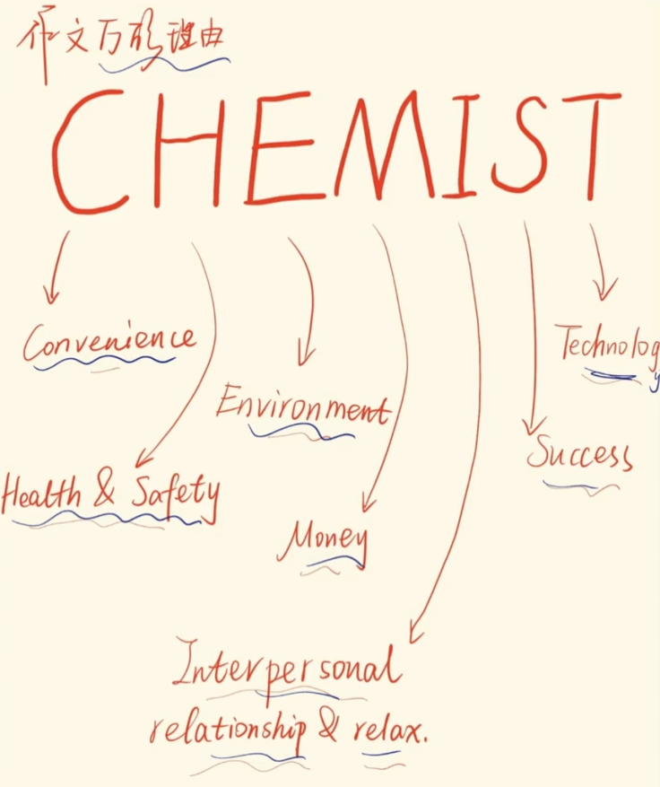

四六级翻译练习与作文模板合集

一、四六级翻译专项训练（附解析）

### （一）基础句型翻译（对应四级难度）&#xA;

#### 1. 被动语态与文化类主题&#xA;

**原文**：中国结（Chinese knot）最初是由手工艺人发明的，经过数百年的演变，已经成为一种优雅多彩的艺术和工艺。**译文**：The Chinese knot was originally invented by craftsmen, and after hundreds of years of evolution, it has become an elegant and colorful art and craft.**解析**：

*   被动结构 "was invented" 体现中文 "由... 发明" 的被动含义

*   "evolve" 对应 "演变"，注意现在完成时 "has become" 表结果

#### 2. 状语从句与社会现象&#xA;

**原文**：当人们开始意识到环境保护的重要性时，越来越多的人选择公共交通出行。**译文**：When people start to realize the importance of environmental protection, more and more people choose to travel by public transport.**解析**：

*   when 引导时间状语从句，注意主从句时态一致性（一般现在时）

*   "public transport" 为四六级高频词汇，避免直译 "公共交通工具"

### （二）复杂结构翻译（对应六级难度）&#xA;

#### 1. 定语从句与科技主题&#xA;

**原文**：5G 技术是一种可以极大提升数据传输速度和网络稳定性的创新技术，它将在未来十年改变人们的生活方式。**译文**：5G technology, an innovative technology that can greatly improve data transmission speed and network stability, will change people's lifestyle in the next decade.**解析**：

*   同位语 "an innovative technology" 简化句子结构

*   that 引导定语从句修饰先行词 technology，注意 "transmission speed" 专业表达

#### 2. 虚拟语气与教育反思&#xA;

**原文**：如果学校当初多开设一些实践课程，学生的动手能力就会得到更好的培养。**译文**：If schools had offered more practical courses before, students' hands-on abilities would have been better cultivated.**解析**：

*   与过去事实相反的虚拟语气：从句 "had offered"，主句 "would have been cultivated"

*   "hands-on abilities" 为教育类高频词汇，避免直译 "动手能力"

#### 3. 倒装句与文化对比&#xA;

**原文**：只有通过跨文化交流，我们才能更好地理解不同民族的价值观和思维方式。**译文**：Only through cross-cultural communication can we better understand the values and ways of thinking of different ethnic groups.**解析**：

*   "only + 状语" 开头的部分倒装结构（can 提前）

*   "ways of thinking" 和 "ethnic groups" 为六级核心词汇

二、万能作文模板（覆盖高频主题）

### （一）现象解释类模板（适用：科技 / 环境 / 社会变化）&#xA;

#### 模板结构：&#xA;

**开头段**（引入现象）Recently, the phenomenon of \[主题词] has aroused wide public concern. According to a recent survey, \[数据 / 事实描述], which shows that \[现象普遍性].

**主体段**（原因分析）There are mainly two reasons contributing to this trend. On the one hand, \[原因 1], especially with the rapid development of \[相关领域], \[具体影响]. On the other hand, \[原因 2], as \[引用俗语 / 观点], \[进一步解释].

**结尾段**（总结展望）In conclusion, \[现象概括] is a natural result of social progress. It is crucial for us to \[提出建议 / 呼吁], so that \[积极影响].

#### 主题套用示例：&#xA;

**例 1：短视频流行（四级）**Recently, the popularity of short videos has aroused wide public concern. According to a recent survey, over 70% of young people watch short videos daily, which shows that this has become a mainstream entertainment mode.There are mainly two reasons contributing to this trend. On the one hand, short videos provide instant happiness and relaxation, especially with the rapid development of mobile internet, people can easily access them anytime, anywhere. On the other hand, they meet the needs of self-expression, as the saying goes "everyone has 15 seconds of fame", users can share their lives quickly.In conclusion, the prevalence of short videos is a natural result of digital age. It is crucial for us to control viewing time properly, so that we can avoid being addicted to them.

### （二）观点对比类模板（适用：校园生活 / 社会争议）&#xA;

#### 模板结构：&#xA;

**开头段**（引出争议）When it comes to \[争议话题], different people hold different opinions. Some people argue that \[观点 1], while others believe that \[观点 2].

**主体段**（分论点论证）Those who support \[观点 1] usually say that \[理由 1]. For example, \[具体事例 1], which proves that \[观点 1 的合理性]. However, the opponents think \[观点 2 的核心论据], citing the fact that \[具体事例 2].

**结尾段**（个人观点）From my perspective, both sides have their merits. But I believe that \[个人观点], because \[深层原因]. Ultimately, the key is to \[平衡建议], so as to \[实现目标].

#### 主题套用示例：&#xA;

**例 2：线上教育 vs 线下教育（六级）**When it comes to education modes, different people hold different opinions. Some people argue that online education is more convenient, while others believe that offline education is more effective.Those who support online education usually say that it breaks the limitations of time and space. For example, students can take courses from top universities without leaving home, which proves that it promotes educational equity. However, the opponents think face-to-face interaction is irreplaceable, citing the fact that teachers can better monitor students' learning status in offline classes.From my perspective, both sides have their merits. But I believe that a combination of the two modes is ideal, because it can integrate the convenience of online learning and the interactivity of offline teaching. Ultimately, the key is to choose the most suitable mode according to different learning objectives.

### （三）问题解决类模板（适用：校园问题 / 社会问题）&#xA;

#### 模板结构：&#xA;

**开头段**（提出问题）Nowadays, \[问题描述] has become a hot issue. It not only affects \[具体群体], but also poses a threat to \[更大范围影响].

**主体段**（解决方案）To solve this problem, three effective measures can be taken. First of all, \[措施 1：政府 / 学校层面], such as \[具体政策]. Secondly, \[措施 2：个人层面], we should \[具体行动]. Finally, \[措施 3：社会层面], mass media should \[宣传引导].

**结尾段**（总结效果）With the joint efforts of all sides, I am confident that \[问题] will be gradually resolved, and we will eventually enjoy \[理想结果].

#### 主题套用示例：&#xA;

**例 3：大学生就业难（四级）**Nowadays, the difficulty of college students' employment has become a hot issue. It not only affects graduates' personal development, but also poses a threat to social stability.To solve this problem, three effective measures can be taken. First of all, universities should optimize their curriculum to match market needs, such as increasing practical courses. Secondly, students should improve their comprehensive abilities, we should participate in internships and develop professional skills. Finally, the government should provide more employment subsidies and entrepreneurship support policies.With the joint efforts of all sides, I am confident that the employment pressure will be gradually relieved, and graduates will find suitable jobs more smoothly.

三、翻译核心技巧总结

### （一）四六级翻译高频考点&#xA;

| 考点类型&#xA;   | 典型例句特征&#xA;                | 翻译策略&#xA;                            |
| ----------- | -------------------------- | ------------------------------------ |
| 被动语态&#xA;   | "由...","被...","受到..."&#xA; | 优先使用 be done 结构&#xA;                 |
| 四字成语&#xA;   | "丰富多彩","历史悠久"&#xA;         | 意译为主（如 "历史悠久"→long history）&#xA;     |
| 时间状语&#xA;   | "经过多年","在过去十年"&#xA;        | 注意时态（现在完成时 / 过去时）&#xA;               |
| 文化专有名词&#xA; | "春节","端午节"&#xA;            | 音译 + 解释（如 Dragon Boat Festival）&#xA; |

### （二）作文模板记忆口诀&#xA;

**现象类**：现象引入→原因分析→建议展望**对比类**：两种观点→分述理由→个人看法**解决类**：问题提出→措施分层→效果总结

### （三）实用替换词表&#xA;

| 基础词汇&#xA;      | 高级替换词&#xA;                  | 适用场景&#xA;    |
| -------------- | --------------------------- | ------------ |
| important&#xA; | crucial/vital&#xA;          | 议论文观点强调&#xA; |
| think&#xA;     | argue/maintain&#xA;         | 观点表达&#xA;    |
| good&#xA;      | beneficial/positive&#xA;    | 积极影响分析&#xA;  |
| many&#xA;      | a large number of&#xA;      | 数据描述&#xA;    |
| so&#xA;        | therefore/consequently&#xA; | 结果推导&#xA;    |

通过以上翻译练习和作文模板，可系统提升四六级应试能力。建议翻译部分先独立翻译再对照解析，重点记忆高频结构；作文模板选择 2-3 个核心版本，用真题题目进行套用练习，形成肌肉记忆。需要针对某个主题（如传统文化 / 科技发展）增加更多模板或翻译例句，可以随时告诉我！